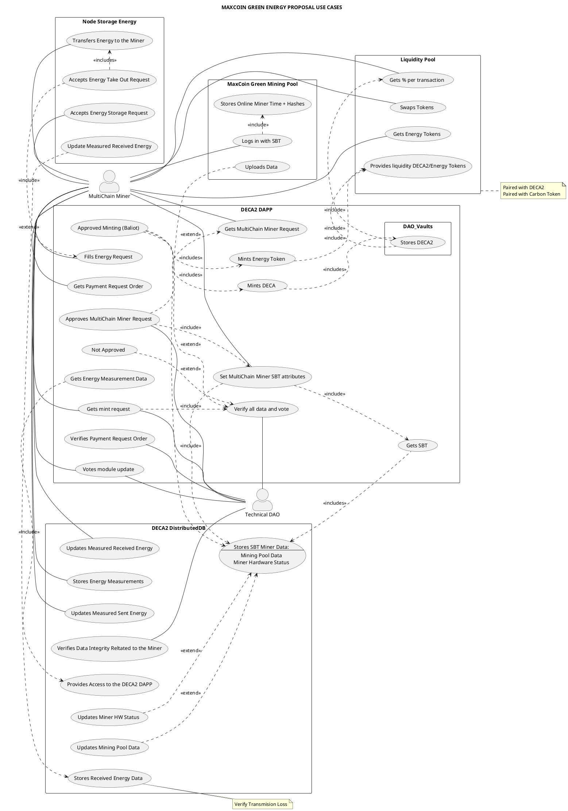
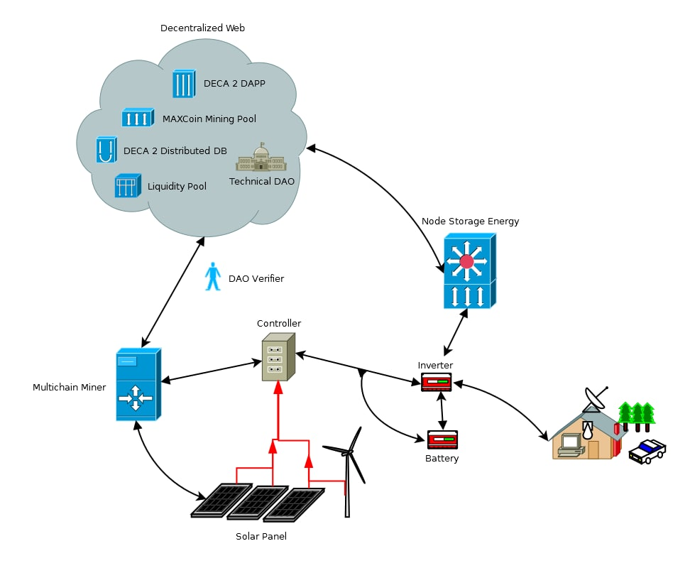
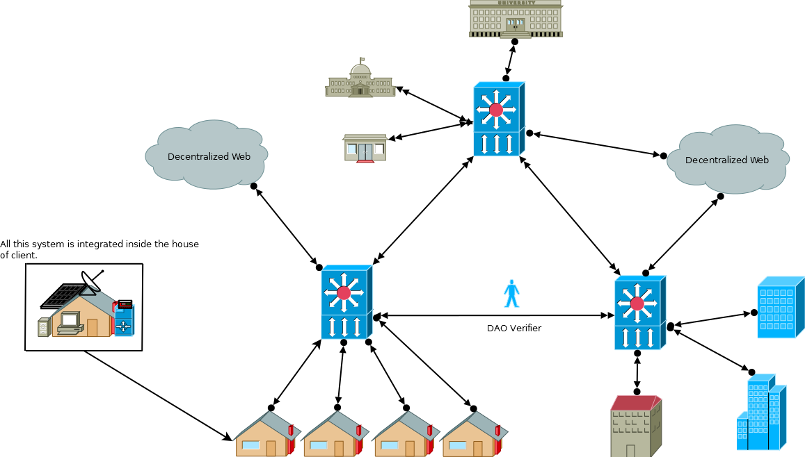
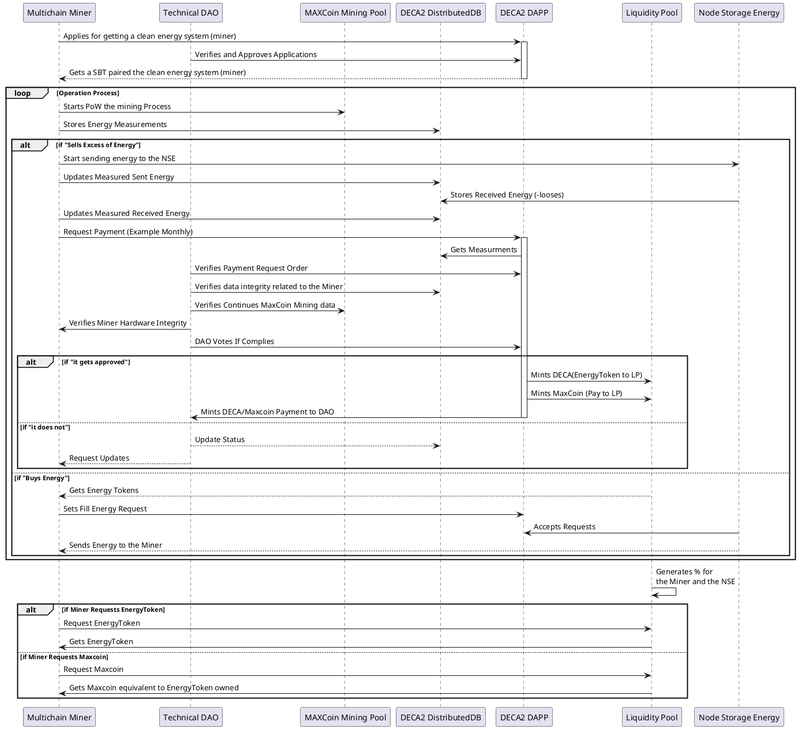

# MAXCOIN GREEN ENERGY PROPOSAL

## LICENSE

```
Copyright (C)  DECENTRALIZED CLIMATE FOUNDATION A.C.
Permission is granted to copy, distribute and/or modify this document
under the terms of the GNU Free Documentation License, Version 1.3
or any later version published by the Free Software Foundation;
with no Invariant Sections, no Front-Cover Texts, and no Back-Cover Texts.
A copy of the license is included in the section entitled "GNU
Free Documentation License". 
```

## DESCRIPTION

A system which can be a functional low scale proof of concept, by tracing real green energy data and representing it as tokens plus a proof of work that ensures the security and online operation consistency in an embedded hardware attached to a solar panel, we intend to achieve the original Satoshi vision (decentralization, and avoid double counting) and thus tokenize measured data with a small range of error.

The goal the following document is a proposal for building a proof of concept system with both hardware and software in a small scale model, this work is not only limited to that but also making some proposals that consider 3rd generation blockchains developments such as the blockchain trilemma , DAOs for management of trust and verification of Green Energy datasets based on embedded open hardware technology, Liquidity Pools and Energy pools (Batteries) with real parity between the real energy and tokens representations of energy.

Following a fully free software as following the main philosophies of the Maxcoin Project (Max Current) and Decentralized Climate Foundation, and finally taking the DECA 2.0 protocol and Maxcoin’s Blockchain as base technologies and other second layer and multichain solutions, as base technologies that will ensure the security and scalability of the system.

## MVP GOALS

## ELECTRICAL SCHEMATIC


## USE CASE



## COMPONENT DIAGRAM



## NETWORK DIAGRAM



## SEQUENCE DIAGRAM



## GANTT DIAGRAM

## FUTURE ACHIEVABLES

## CONCLUSION

## REFERENCES

\[1\] Manisa Pipattanasomporn; Murat Kuzlu; Saifur Rahman, "A Blockchain-based Platform for Exchange of Solar Energy: Laboratory-scale Implementation", https://ieeexplore.ieee.org/stamp/stamp.jsp?tp=&arnumber=8635679, 2018.

\[2\] Joint Research Centre (JRC), "Energy system blockchain solutions", https://ses.jrc.ec.europa.eu/node/31977, October 2022.

\[3\] Anselma Wörner, Arne Meeuw, Liliane Ableitner, Felix Wortmann, Sandro Schopfer and
Verena Tiefenbeck, "Trading solar energy within the neighborhood: field implementation of a blockchain-based electricity market",https://energyinformatics.springeropen.com/track/pdf/10.1186/s42162-019-0092-0.pdf, September 2019.

\[4\] Merlinda Andoni, Valentin Robu, David Flynn, Simone Abram, Dale Geach, David Jenkins, Peter McCallum, Andrew Peacock, "Blockchain technology in the energy sector: A systematic review of challenges and opportunities", https://www.sciencedirect.com/science/article/pii/S1364032118307184?via%3Dihub,  February 2019.

\[5\] Subin Kwak, Joohyung Lee, Jangkyum Kim, and Hyeontaek Oh, "EggBlock: Design and Implementation of Solar Energy Generation and Trading Platform in Edge-Based IoT Systemswith Blockchain", https://www.ncbi.nlm.nih.gov/pmc/articles/PMC8951093/pdf/sensors-22-02410.pdf, March 2022.

\[6\] Naiyu Wang, Xiao Zhou, Xin Lu, Zhitao Guan, "When Energy Trading meets Blockchain in ElectricalPower System: The State of the Art", https://arxiv.org/ftp/arxiv/papers/1902/1902.07233.pdf, 2018.

\[7\] Energypedia.info, "Blockchain Techologies For the Energy Access Sector", [https://energypedia.info/wiki/Blockchain\_Techologies\_For\_the\_Energy\_Access\_Sector#ImpactPPA](https://energypedia.info/wiki/Blockchain_Techologies_For_the_Energy_Access_Sector#ImpactPPA), 2022.


